# LangChain Playbook Learning Guide 📚

Complete learning progression from beginner to expert level. Follow this structured path to master LangChain development.

## 🎯 Learning Objectives

Transform from a complete beginner to a LangChain expert capable of building production-ready AI applications.

## 📊 Learning Path Overview

```mermaid
graph TD
    A[🎓 Prerequisites] --> B[📚 Basics]
    B --> C[🔧 Intermediate]
    C --> D[🚀 Advanced]
    D --> E[🎯 Projects]
    E --> F[🏆 Expert Level]
    
    B1[Getting Started] --> B2[Models]
    B2 --> B3[Prompts]
    B3 --> B4[Chains]
    B4 --> B5[Output Parsers]
    
    C1[Memory] --> C2[Agents]
    C2 --> C3[Retrieval/RAG]
    C3 --> C4[Callbacks]
    C4 --> C5[Async Operations]
    
    D1[Custom Tools] --> D2[Multi-Agent]
    D2 --> D3[Evaluation]
    D3 --> D4[Deployment]
    D4 --> D5[Optimization]
    
    P1[Chatbot] --> P2[Document Q&A]
    P2 --> P3[Code Assistant]
    P3 --> P4[Research Assistant]
    P4 --> P5[API Service]
```



## 🏃‍♂️ Quick Start (15 minutes)

1. **Setup Environment**
   ```bash
   git clone <repository-url>
   cd Langchain-Playbook
   python -m venv .venv
   .venv\Scripts\activate  # Windows
   pip install -r requirements.txt
   ```

2. **Configure API Keys**
   ```bash
   cp .env.example .env
   # Edit .env with your OpenAI API key
   ```

3. **Run First Example**
   ```bash
   cd basics/01_getting_started
   python hello_langchain.py
   ```

## 📚 Phase 1: Foundations (Week 1-2)

### 🎓 Prerequisites
**Time Investment:** 2-4 hours
- Python programming basics
- Basic understanding of APIs
- Familiarity with virtual environments

### 📚 Basics Section (Week 1)
**Daily Time Investment:** 1-2 hours

#### Day 1: Getting Started
- **Location:** `basics/01_getting_started/`
- **Objective:** Understand LangChain fundamentals
- **Files to run:**
  ```bash
  python hello_langchain.py
  python environment_setup.py
  python basic_chat.py
  ```
- **Key Concepts:** LLMs, API integration, basic responses
- **Exercise:** Modify examples to use different models

#### Day 2: Models Deep Dive
- **Location:** `basics/02_models/`
- **Objective:** Master different model types
- **Files to run:**
  ```bash
  python llm_comparison.py
  python model_parameters.py
  ```
- **Key Concepts:** Temperature, tokens, model selection
- **Exercise:** Compare responses across different models

#### Day 3: Prompt Engineering
- **Location:** `basics/03_prompts/`
- **Objective:** Create effective prompts
- **Files to run:**
  ```bash
  python prompt_templates.py
  python few_shot_prompts.py
  python prompt_engineering.py
  ```
- **Key Concepts:** Templates, variables, few-shot learning
- **Exercise:** Build prompts for your specific use case

#### Day 4: Chains and Workflows
- **Location:** `basics/04_chains/`
- **Objective:** Compose complex operations
- **Files to run:**
  ```bash
  python simple_chains.py
  python sequential_chains.py
  ```
- **Key Concepts:** Chain composition, sequential processing
- **Exercise:** Create a multi-step analysis chain

#### Day 5: Output Parsing
- **Location:** `basics/05_output_parsers/`
- **Objective:** Structure LLM responses
- **Files to run:**
  ```bash
  python output_parsers.py
  python structured_output.py
  ```
- **Key Concepts:** JSON parsing, data validation, type safety
- **Exercise:** Parse LLM output into Python objects

#### Day 6-7: Practice and Review
- Complete all basic exercises
- Build a simple Q&A system
- Review and reinforce concepts

**📋 Checkpoint:** Can you build a basic chatbot that uses prompts and parses outputs?

## 🔧 Phase 2: Intermediate Features (Week 3-4)

### Week 3: Core Intermediate Concepts
**Daily Time Investment:** 2-3 hours

#### Day 1: Memory Systems
- **Location:** `intermediate/01_memory/`
- **Objective:** Add conversation context
- **Files to run:**
  ```bash
  python conversational_memory.py
  ```
- **Key Concepts:** Conversation history, context windows
- **Exercise:** Build a chatbot with memory

#### Day 2: Agents and Tools
- **Location:** `intermediate/02_agents/`
- **Objective:** Create tool-using AI
- **Files to run:**
  ```bash
  python basic_agents.py
  ```
- **Key Concepts:** Tool usage, agent reasoning
- **Exercise:** Create an agent with custom tools

#### Day 3: Retrieval and RAG
- **Location:** `intermediate/03_retrieval/`
- **Objective:** Build knowledge-based systems
- **Files to run:**
  ```bash
  python rag_basics.py
  ```
- **Key Concepts:** Vector stores, embeddings, retrieval
- **Exercise:** Build a document Q&A system

#### Day 4: Callbacks and Monitoring
- **Location:** `intermediate/04_callbacks/`
- **Objective:** Add observability
- **Files to run:**
  ```bash
  python callback_handlers.py
  ```
- **Key Concepts:** Logging, metrics, debugging
- **Exercise:** Add monitoring to your applications

#### Day 5: Async Operations
- **Location:** `intermediate/05_async/`
- **Objective:** Improve performance
- **Files to run:**
  ```bash
  python async_langchain.py
  ```
- **Key Concepts:** Concurrency, async/await, performance
- **Exercise:** Make your applications async

### Week 4: Integration and Practice
- Combine multiple intermediate concepts
- Build more complex applications
- Performance optimization

**📋 Checkpoint:** Can you build a RAG system with agents and proper monitoring?

## 🚀 Phase 3: Advanced Expertise (Week 5-6)

### Week 5: Advanced Development
**Daily Time Investment:** 3-4 hours

#### Day 1-2: Custom Tools
- **Location:** `advanced/01_custom_tools/`
- **Objective:** Build specialized tools
- **Key Concepts:** Tool development, security, validation
- **Exercise:** Create domain-specific tools

#### Day 3-4: Multi-Agent Systems
- **Location:** `advanced/02_multi_agent/`
- **Objective:** Coordinate multiple agents
- **Key Concepts:** Agent communication, task delegation
- **Exercise:** Build a multi-agent research team

#### Day 5: Evaluation Frameworks
- **Location:** `advanced/03_evaluation/`
- **Objective:** Test and benchmark systems
- **Key Concepts:** Metrics, A/B testing, quality assessment
- **Exercise:** Evaluate your applications

### Week 6: Production Readiness

#### Day 1-3: Deployment
- **Location:** `advanced/04_deployment/`
- **Objective:** Deploy to production
- **Key Concepts:** Docker, Kubernetes, CI/CD
- **Exercise:** Deploy an application to the cloud

#### Day 4-5: Optimization
- **Location:** `advanced/05_optimization/`
- **Objective:** Optimize performance and costs
- **Key Concepts:** Caching, token optimization, scaling
- **Exercise:** Optimize an existing application

**📋 Checkpoint:** Can you deploy and optimize a production-ready LangChain application?

## 🎯 Phase 4: Real-World Projects (Week 7-8)

### Project-Based Learning
**Time Investment:** 4-6 hours per project

#### Project 1: Conversational Chatbot
- **Location:** `projects/chatbot/`
- **Duration:** 2 days
- **Skills:** Memory, personality, tool integration
- **Deliverable:** Multi-personality chatbot with tools

#### Project 2: Document Q&A System
- **Location:** `projects/document_qa/`
- **Duration:** 2 days
- **Skills:** RAG, vector databases, source attribution
- **Deliverable:** Enterprise document assistant

#### Project 3: Code Assistant
- **Location:** `projects/code_assistant/`
- **Duration:** 2 days
- **Skills:** Code generation, analysis, debugging
- **Deliverable:** AI-powered development tool

#### Project 4: Research Assistant
- **Location:** `projects/research_assistant/`
- **Duration:** 2 days
- **Skills:** Multi-source analysis, report generation
- **Deliverable:** Automated research tool

#### Project 5: API Service
- **Location:** `projects/api_service/`
- **Duration:** 2 days
- **Skills:** Production deployment, scaling, monitoring
- **Deliverable:** LangChain-powered REST API

## 📓 Interactive Learning (Throughout)

### Jupyter Notebooks
**Location:** `notebooks/`
- **Tutorials:** Step-by-step guided learning
- **Exploration:** Experiment with cutting-edge techniques
- Run notebooks for hands-on practice

### Recommended Schedule
- Start each topic with relevant notebook
- Use notebooks for experimentation
- Create your own notebooks for custom use cases

## ✅ Learning Checkpoints

### After Basics (Week 1)
- [ ] Built your first LangChain application
- [ ] Compared different models and parameters
- [ ] Created effective prompt templates
- [ ] Composed chains for complex workflows
- [ ] Parsed structured output from LLMs

### After Intermediate (Week 4)
- [ ] Added conversation memory to applications
- [ ] Built agents that use tools effectively
- [ ] Implemented RAG for knowledge retrieval
- [ ] Added monitoring and logging
- [ ] Optimized performance with async operations

### After Advanced (Week 6)
- [ ] Developed custom tools for specific domains
- [ ] Designed multi-agent coordination systems
- [ ] Implemented comprehensive evaluation frameworks
- [ ] Deployed applications to production
- [ ] Optimized for performance and cost

### After Projects (Week 8)
- [ ] Built 5 different types of applications
- [ ] Demonstrated full-stack LangChain development
- [ ] Created production-ready solutions
- [ ] Showed expertise across the entire ecosystem

## 🎖️ Skill Progression

### Beginner (Weeks 1-2)
- Basic LangChain concepts
- Simple applications
- Prompt engineering
- Model interaction

### Intermediate (Weeks 3-4)
- Complex applications
- RAG systems
- Agent development
- Performance optimization

### Advanced (Weeks 5-6)
- Custom tool development
- Multi-agent systems
- Production deployment
- System optimization

### Expert (Weeks 7-8)
- Full-stack applications
- Production-ready systems
- Advanced architectures
- Industry best practices

## 📊 Assessment and Certification

### Self-Assessment Questions
After each phase, ask yourself:
1. Can I explain the concepts to someone else?
2. Can I build applications using these concepts?
3. Can I troubleshoot and debug issues?
4. Can I optimize and improve existing solutions?

### Portfolio Projects
Build these to demonstrate expertise:
1. **Personal AI Assistant** (combines multiple concepts)
2. **Domain-Specific Tool** (showcases specialization)
3. **Production Application** (demonstrates deployment skills)

## 🔄 Continuous Learning

### Stay Updated
- Follow LangChain releases and updates
- Join community discussions
- Contribute to open source projects
- Attend conferences and meetups

### Advanced Topics
After completing this playbook:
- Explore LangGraph for complex workflows
- Learn LangSmith for production monitoring
- Study cutting-edge research papers
- Build domain-specific applications

## 🆘 Getting Help

### When You're Stuck
1. **Check Documentation:** Each section has detailed READMEs
2. **Review Examples:** Look at similar implementations
3. **Use Troubleshooting Guide:** `docs/troubleshooting.md`
4. **Ask Community:** GitHub Discussions, Discord
5. **Debug Systematically:** Use callbacks and logging

### Common Learning Blockers
- **API Key Issues:** Check `docs/api-keys.md`
- **Environment Problems:** Run `environment_setup.py`
- **Concept Confusion:** Review prerequisites
- **Code Errors:** Check error messages and logs

## 📈 Success Metrics

Track your progress:
- **Code Quality:** Clean, documented, tested
- **Problem Solving:** Can debug and optimize
- **Architecture:** Design scalable solutions
- **Production:** Deploy and monitor applications

---

**🚀 Ready to start your LangChain journey? Begin with the basics and work your way up!**

**💡 Remember:** Learning is iterative. Don't be afraid to revisit earlier concepts as you progress through advanced topics.